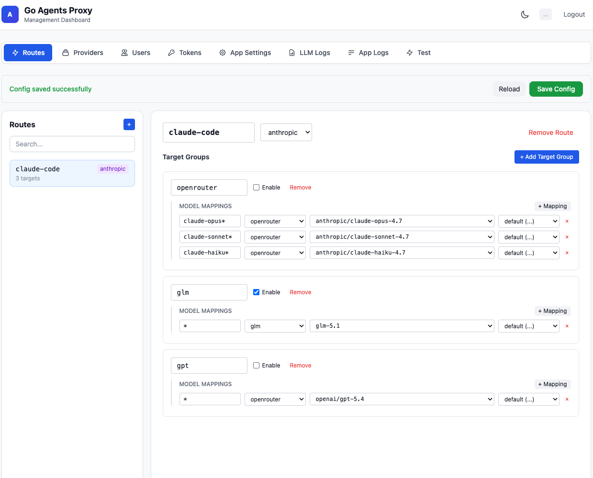

# Go Agents Proxy

An  Agents API proxy server written in Go. Accepts Anthropic/OpenAI/Google-format requests and forwards them to configured upstream providers (OpenAI, Google/Gemini, Anthropic) with automatic format conversion, provider failover, and a built-in web management UI.

## Key Features

1. **Config-Driven Routing**: Define routes, models, and provider fallbacks in `config.yaml`
2. **Multi-Provider Support**: Supports OpenAI, Google (Gemini), and Anthropic API providers
3. **Automatic Provider Failover**: If one provider fails, automatically tries the next configured target
4. **API Format Conversion**: Automatically converts Anthropic API format to OpenAI/Google format and converts responses back to Anthropic format
5. **Streaming Response**: Full support for SSE streaming responses, including `tool_use` events
6. **Tool Calling**: Supports Anthropic's `tool_use` and `tool_result` format conversion
7. **Web Management UI**: Built-in admin dashboard at `/` (alpine.js, compiled into the binary)
8. **Config Hot Reload**: Changes to `config.yaml` are automatically picked up without restart
9. **Structured Logging**: Application logs via `slog` + per-request LLM call logs in JSONL format
10. **HTTP Proxy Support**: Supports forwarding requests through an HTTP proxy

### LLM API

| Route | Description |
|-------|-------------|
| `/llm/<route-id>/v1/messages` | Forward to the route's configured provider(s) |
| `/llm/<route-id>/v1/messages/count_tokens` | Token counting (proxied for Anthropic, estimated for OpenAI/Google) |

The `route-id` is defined in `config.yaml` under `routes`. Each route has an `api_type` (`anthropic`, `openai`, `gemini`) and a list of models with optional fallback `targets`.

### Management API

| Route | Method | Description |
|-------|--------|-------------|
| `/api/config` | GET | Get current configuration |
| `/api/config` | POST | Update configuration (writes to `config.yaml` and hot reloads) |
| `/api/routes` | GET | List all routes |
| `/api/providers` | GET | List all providers |
| `/api/logs/llm` | GET | Query LLM call logs (`?date=YYYY-MM-DD&limit=100&offset=0`) |
| `/api/logs/app` | GET | Tail application logs (`?limit=100`) |

### Admin UI

Open `http://localhost:8082/` in a browser to access the management dashboard.



## Configuration (`config.yaml`)

```yaml
app:
  level: info                     # Log level: debug/info/warn/error
  auth: true                     # Enable API key authentication
  listen: "0.0.0.0"              # Bind address
  port: "8082"                   # Listening port (overrides PORT env var)

users:
  - name: admin
    token: your_token            # API key for proxy auth
  - name: admin2
    password: your_password      # Alternative credential (also accepted)

tokens:
  - id: claude-code
    token: xxxxx                  # Additional API keys

routes:
  claude-code:
    api_type: anthropic
    targets:
      - name: openrouter
        enable: true
        models:
          - match_model: claude-opus*
            provider: openrouter
            model_id: anthropic/claude-opus-4-20250514
            api_name: default
          - match_model: claude-sonnet*
            provider: openrouter
            model_id: anthropic/claude-sonnet-4-20250514
            api_name: default
      - name: anthropic
        enable: true
        models:
          - match_model: '*'
            provider: anthropic
            model_id: claude-sonnet-4-20250514
            api_name: default

  codex:
    api_type: openai
    targets:
      - name: openrouter
        enable: true
        models:
          - match_model: plan
            provider: openrouter
            model_id: gpt-5.5
            api_name: default
          - match_model: plan
            provider: openrouter
            model_id: gpt-4o
            api_name: default

providers:
  openrouter:
    models:
      - model_id: openai/gpt-5.5
    apis:
      - name: default
        api_type: openai
        base_url: https://openrouter.ai/api/v1
        api_key: sk-or-xxx

  anthropic:
    models:
      - model_id: claude-sonnet-4-20250514
    apis:
      - name: default
        api_type: anthropic
        base_url: https://api.anthropic.com/v1
        api_key: sk-ant-xxx
```

### Config Fields

- `app.level`: Application log level (`debug`/`info`/`warn`/`error`). Overrides `LOG_LEVEL` env var.
- `app.auth`: Enable/disable API key authentication. Set to `false` to allow all requests.
- `app.listen`: Bind address (default: `0.0.0.0`).
- `app.port`: Service listening port. Overrides `PORT` env var.
- `users`: List of users with API access. Each user has `name`, and either `token` or `password` (both are accepted as valid API keys).
- `tokens`: Additional API keys (identified by `id`)
- `routes`: Route definitions
  - `api_type`: `anthropic`, `openai`, or `gemini`
  - `targets`: Ordered list of target groups (failover chain). Each group has:
    - `name`: Identifier for this target group
    - `enable`: Whether this group is active
    - `models`: Model mappings within this group
      - `match_model`: Pattern to match the client-sent model ID. Supports exact match, prefix wildcard (`"prefix-*"`), and full wildcard (`"*"`).
      - `provider`: The provider to forward matched requests to
      - `model_id`: The actual model ID sent to the provider
      - `api_name`: Optional. Selects a specific API endpoint from the provider
- `providers`: Provider definitions
  - `proxy`: Optional HTTP proxy URL for requests to this provider (overrides the global `PROXY_URL` env var)
  - `models`: List of available models (for documentation/validation)
  - `apis`: List of API endpoints for this provider
    - `name`: Identifier for this API endpoint
    - `api_type`: `openai`, `anthropic`, or `gemini`
    - `base_url`: Base URL for the API
    - `api_key`: API key

## Environment Variables

| Variable | Required | Default | Description |
|----------|----------|---------|-------------|
| `PORT` | No | `8082` | Service listening port. Can be overridden by `app.port` in `config.yaml` |
| `LOG_LEVEL` | No | `info` | Log level (`debug`/`info`/`warn`/`error`). Can be overridden by `app.level` in `config.yaml` |

API keys and base URLs are now configured in `config.yaml` instead of environment variables. The `.env` file is still supported for `PORT`, `LOG_LEVEL`, and `PROXY_URL`.

## Usage

### 1. Create `config.yaml`

See the example above. At minimum, define one route and one provider. If `app.auth` is `true` (default), configure at least one user or token.

### 2. Run Service

```bash
go run main.go
# Or with a custom config path:
go run main.go /path/to/config.yaml
```

### 3. Send Requests

```bash
# Send to a route (e.g. 'claude-code' defined in config.yaml)
curl -X POST http://localhost:8082/llm/claude-code/v1/messages \
  -H "Content-Type: application/json" \
  -H "x-api-key: your_token" \
  -d '{
    "model": "code",
    "max_tokens": 1024,
    "messages": [{"role": "user", "content": "Hello!"}]
  }'
```

The proxy will look up the route `claude-code`, find the model `code`, resolve its targets, and forward the request. If the first target fails with a network error or 5xx, it automatically tries the next target.

### 4. Manage via Web UI

Open `http://localhost:8082/` and log in with your API key to browse routes, providers, logs, and edit configuration.

## Authentication

The proxy service supports two authentication methods:

1. **x-api-key Header**: `x-api-key: your_token`
2. **Authorization Header**: `Authorization: Bearer your_token`

The token is matched against all `users` tokens/passwords and all `tokens` entries. If `app.auth` is set to `false`, authentication is disabled and all requests are accepted. If auth is enabled but no users or tokens are configured, all requests are rejected.

## Feature Details

### Format Conversion

- **OpenAI/Gemini Routes**: Converts Anthropic format requests to OpenAI format, calls the corresponding API, then converts responses back to Anthropic format
- **Anthropic Route**: Directly proxies requests to Anthropic API without format conversion

### Streaming Response

Supports SSE (Server-Sent Events) streaming responses, including:
- `message_start` - Message start
- `content_block_start` - Content block start
- `content_block_delta` - Content delta
- `content_block_stop` - Content block stop
- `message_delta` - Message delta
- `message_stop` - Message stop

### Tool Calling

Full support for tool calling functionality:
- Converts Anthropic's `tools` format to OpenAI's `functions` format
- Handles `tool_use` and `tool_result` message types
- Automatically cleans up schema fields not supported by Google API

### Logging

- **Application log**: `logs/app.log` — structured text logs via `slog`
- **LLM call log**: `logs/llm-YYYY-MM-DD.jsonl` — one JSON line per API call with fields: `timestamp`, `route_id`, `model_id`, `provider`, `target_model`, `duration_ms`, `status_code`, `error`, `input_tokens`, `output_tokens`

Both logs are browsable through the web UI.

## Dependencies

- [github.com/google/uuid](https://github.com/google/uuid) — UUID generation
- [github.com/joho/godotenv](https://github.com/joho/godotenv) — Environment variable loading
- [github.com/fsnotify/fsnotify](https://github.com/fsnotify/fsnotify) — Config file watching
- [gopkg.in/yaml.v3](https://gopkg.in/yaml.v3) — YAML parsing

## Install Dependencies

```bash
go mod tidy
```

## Docker

### Build Image

```bash
docker build -t go-agents-proxy .
```

### Run Container

```bash
docker run -d -p 8082:8082 \
    -v $(pwd)/config.yaml:/app/config.yaml \
    ghcr.io/mark0725/go-agents-proxy:latest
```

## License

MIT
